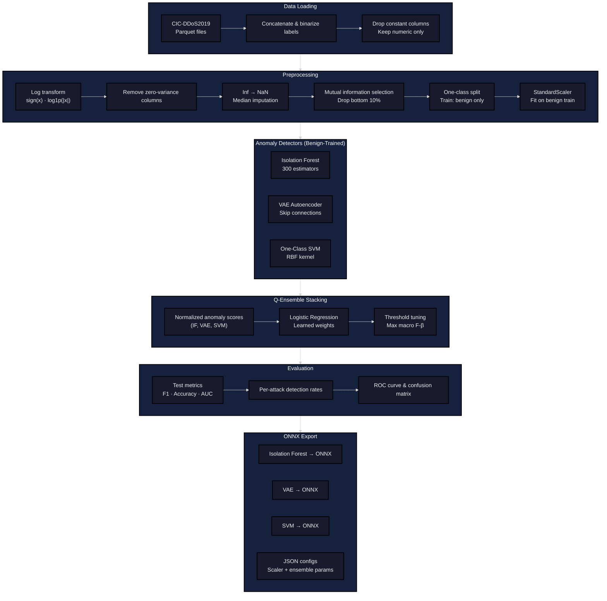
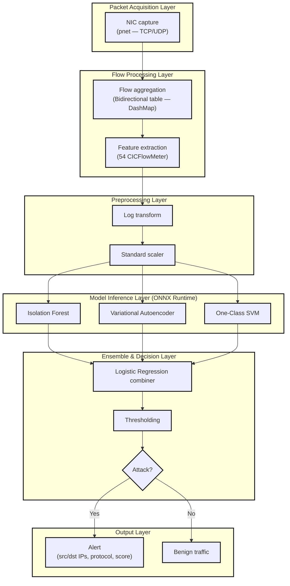

# Ensemble DDoS Detection

Real-time DDoS mitigation using a Q-Ensemble of three one-class anomaly detectors (Isolation Forest, VAE Autoencoder, One-Class SVM) trained on the CIC-DDoS2019 dataset, with a Rust-based real-time packet ingestion agent for live detection.

## Quick Start

### Training (Python)

```bash
# 1. Install dependencies
uv sync

# 2. Train all models + evaluate
uv run python train.py

# 3. Export to ONNX (skip retraining)
uv run python train.py --export-only
```

> **Note:** The dataset must be placed in `Datasets/cicddos2019/` as parquet files.
> Download from: https://www.kaggle.com/datasets/dhoogla/cicddos2019

### Real-Time Detection (Rust)

```bash
# 1. Build the detection agent
cargo build --release

# 2. Run on a network interface (requires root/CAP_NET_RAW)
sudo ./target/release/ensemble-ddos-detection \
    --interface eth0 \
    --models-dir models/exported/onnx/ \
    --timeout 120
```

#### CLI Options

| Flag | Default | Description |
|---|---|---|
| `-i, --interface` | *(required)* | Network interface to capture on (e.g. `eth0`, `wlan0`) |
| `-m, --models-dir` | `models/exported/onnx` | Path to ONNX models + JSON configs |
| `-t, --timeout` | `120` | Flow inactivity timeout in seconds |
| `-s, --sweep-interval` | `10` | How often to classify expired flows (seconds) |

The agent captures live traffic, groups packets into bidirectional flows, computes 54 CICFlowMeter-style features per flow, and runs the ensemble through ONNX Runtime. Detected attacks are logged with 🚨 alerts showing source/destination IPs, protocol, and the combined detection probability.


## Model Performance

| Metric | Score |
|---|---|
| **F1 Score** | 0.995 |
| **Accuracy** | 99.0% |
| **Benign Recall** | 92.3% |
| **Attack Recall** | 99.6% |
| **ROC-AUC** | 0.996 |

### ROC Curve


### Confusion Matrix


## Architecture

### ML Processing Pipeline



### Real-Time Detection Agent



## Project Structure

```
ensemble_ddos_detection/          # Python training pipeline
├── config.py                     # Hyperparams & paths
├── data/
│   ├── loader.py                 # Load parquets, preserve attack types
│   └── preprocessor.py           # Log-transform, MI selection, scaling
├── models/
│   ├── isolation_forest.py       # Isolation Forest wrapper
│   ├── autoencoder.py            # VAE with skip connections
│   ├── one_class_svm.py          # One-Class SVM wrapper
│   └── q_ensemble.py             # Logistic Regression stacking combiner
├── training/
│   └── trainer.py                # Full pipeline orchestrator
├── evaluation/
│   └── metrics.py                # Metrics + per-attack-type evaluation
└── export/
    └── exporter.py               # Export all models to ONNX

src/                              # Rust real-time agent
├── main.rs                       # CLI, capture thread, sweep loop
├── capture.rs                    # Packet capture via pnet (TCP/UDP)
├── flow.rs                       # Concurrent flow table (DashMap)
├── features.rs                   # 54-feature CICFlowMeter extraction
├── preprocess.rs                 # Log-transform + StandardScaler
├── inference.rs                  # ONNX inference + LR combiner
├── config.rs                     # JSON config deserialization
├── tui/                          # Terminal UI (ratatui)
│   ├── app.rs                    # App state, event handling, tab navigation
│   ├── event.rs                  # Terminal event loop
│   ├── collectors/               # Background data collectors
│   │   ├── config.rs             # Config collector
│   │   ├── connections.rs        # Active connections collector
│   │   ├── geo.rs                # GeoIP lookups
│   │   ├── health.rs             # System health metrics
│   │   └── traffic.rs            # Traffic statistics
│   ├── platform/                 # OS-specific network interface detection
│   │   ├── linux.rs
│   │   ├── macos.rs
│   │   └── windows.rs
│   └── ui/                       # Tab UI renderers
│       ├── dashboard.rs          # Overview dashboard
│       ├── connections.rs        # Active connections table
│       ├── topology.rs           # Network topology view
│       ├── timeline.rs           # Traffic timeline graphs
│       ├── interfaces.rs         # Network interfaces tab
│       ├── ddos_logs.rs          # DDoS detection log viewer
│       ├── help.rs               # Help / keybindings tab
│       └── widgets.rs            # Shared widget helpers
└── test/                         # Unit tests
    ├── test_config.rs
    ├── test_features.rs
    ├── test_flow.rs
    ├── test_inference.rs
    └── test_preprocess.rs

models/exported/                  # Trained model artifacts
├── onnx/                         # ONNX models for Rust inference
├── *.pkl                         # Pickled sklearn models
├── *.pt                          # PyTorch checkpoints
└── *.json                        # Scaler, ensemble & normalization configs

train.py                          # Python CLI entry-point
```