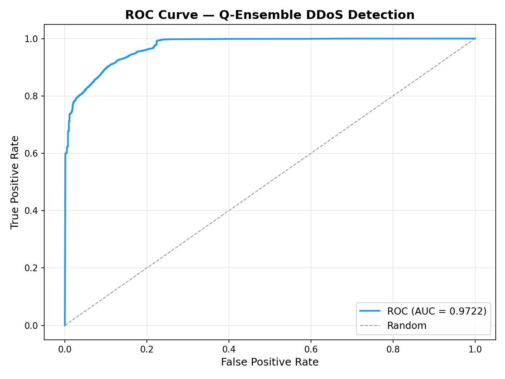
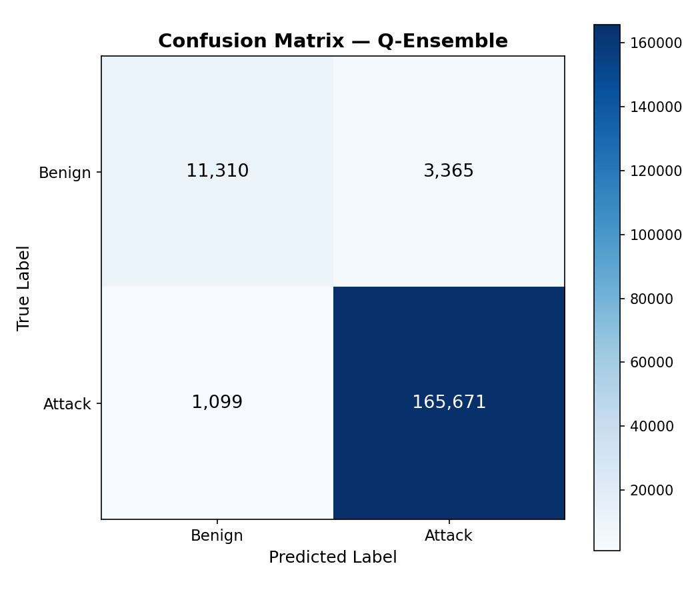

# Ensemble DDoS Detection

Real-time DDoS mitigation using a Q-Ensemble of three one-class anomaly detectors (Isolation Forest, Autoencoder, One-Class SVM) trained on the CIC-DDoS2019 dataset.

## Quick Start

```bash
# 1. Install dependencies
uv sync

# 2. Train all models
uv run python train.py

# 3. Train + export to ONNX (for Rust inference)
uv run python train.py --export
```

> **Note:** The dataset must be placed in `Datasets/cicddos2019/` as parquet files.
> Download from: https://www.kaggle.com/datasets/dhoogla/cicddos2019

## Project Structure

```
ensemble_ddos_detection/
├── config.py                    # Hyperparams & paths
├── data/
│   ├── loader.py                # Load & merge parquets, binarize labels
│   └── preprocessor.py          # Clean, normalize, train/val/test split
├── models/
│   ├── isolation_forest.py      # Scikit-learn Isolation Forest wrapper
│   ├── autoencoder.py           # PyTorch Autoencoder
│   ├── one_class_svm.py         # Scikit-learn One-Class SVM wrapper
│   └── q_ensemble.py            # Weighted score-level ensemble
├── training/
│   └── trainer.py               # Orchestrates training of all 3 models
├── evaluation/
│   └── metrics.py               # Precision, Recall, F1, ROC-AUC, confusion matrix
└── export/
    └── exporter.py              # Export all models to ONNX
train.py                          # CLI entry-point for full pipeline
```

### ROC Curve

The ROC curve shows the trade-off between true positive rate and false positive rate. An AUC of **0.97** indicates strong separation between benign and attack traffic.



### Confusion Matrix

The confusion matrix shows the ensemble correctly identifies 99.8% of attacks with minimal false positives.


